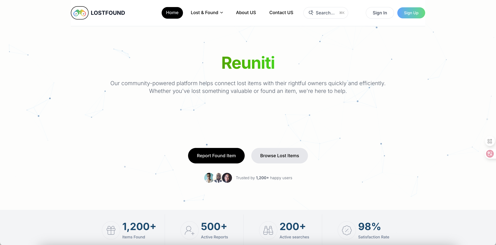
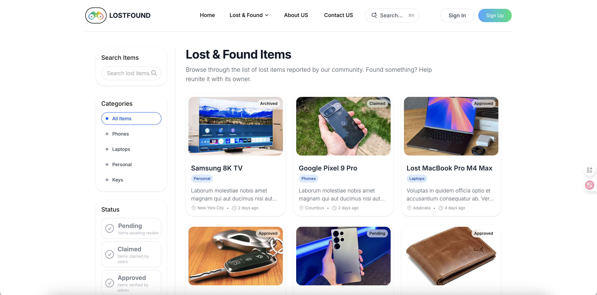
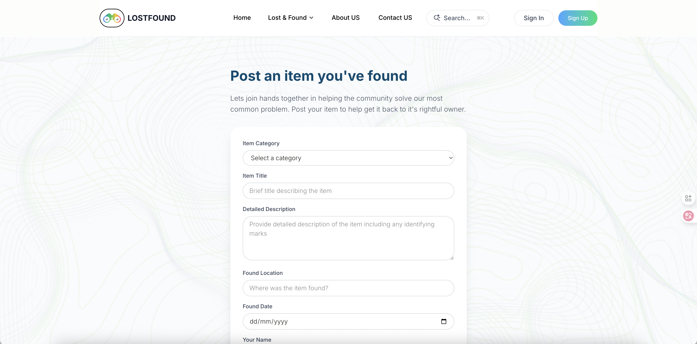
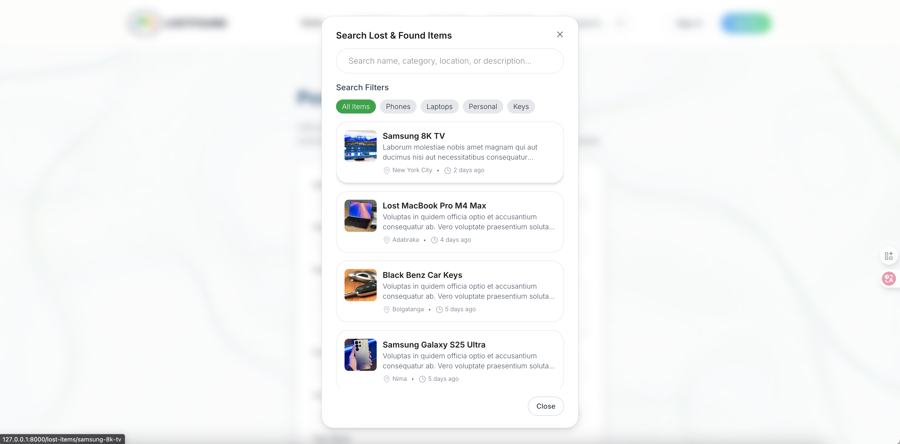
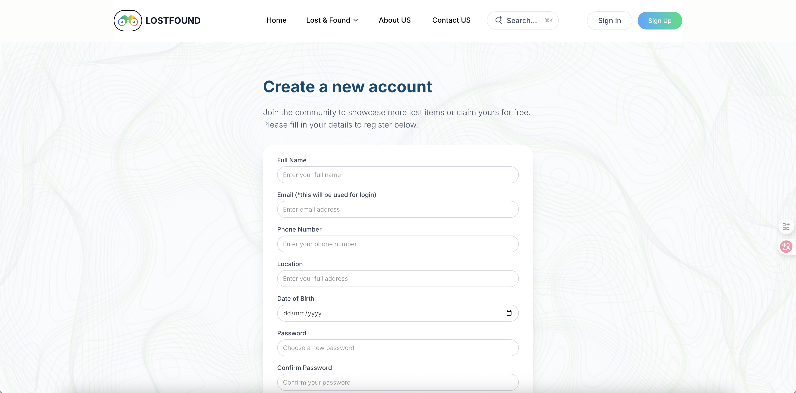
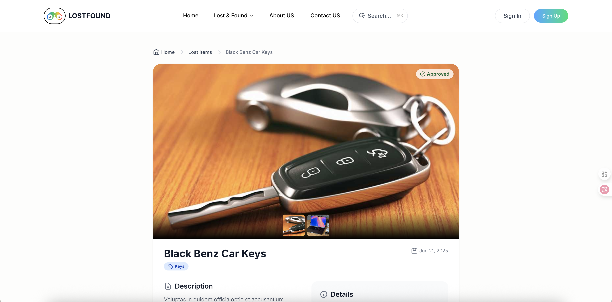
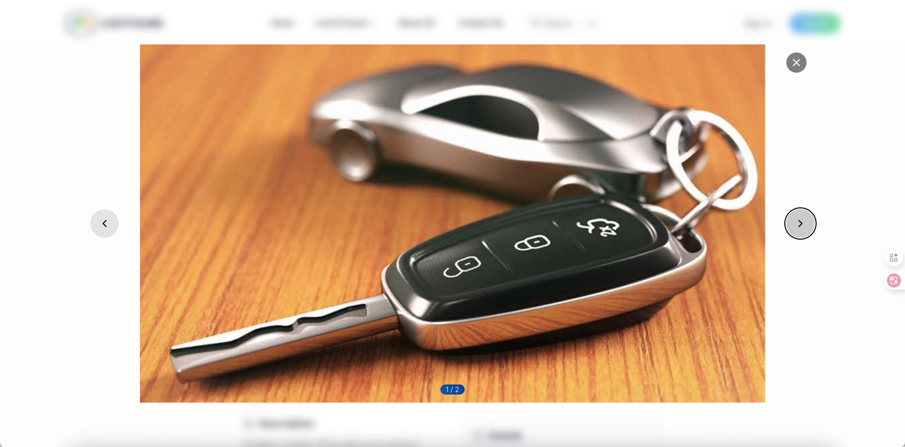
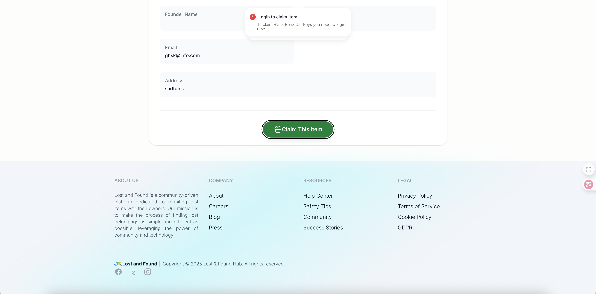

# 📦 LoFo - Lost & Found System


# ***Lost it, found it.***

---

## 🔍 Overview

**LoFo** (short for  **Lost Found** ) is a modern, elegant, and fully responsive web application designed to help users report lost items and find missing belongings within their community. Built with the power of **Laravel**, **Livewire**, **Alpine.js**, and **Tailwind CSS** , LoFo offers a seamless experience for individuals to connect and reunite lost items with their rightful owners.

This system is ideal for campuses, offices, communities, or public spaces where people frequently lose or find items and want an organized way to report and track them.

## 📸 Screenshots

|  |  |
| ---------------------------------------------- | ---------------------------------------------- |
|  |  |
|  |  |
|  |  |
|  |  |

## 💡 Features

1. 🧾 **Report Lost Items**: Users can submit detailed reports including item name, description, location, date, and photos.
2. 📸  **Multi-image Upload**: Support for uploading multiple images to help identify the lost/found item clearly.
3. 🔍  **Search & Filter**: Powerful search functionality to look up lost or found items by category, date, or keywords.
4. 📨  **Contact Form**: A built-in messaging system that allows users to send inquiries or suggestions directly to the admin.
5. 👤  **Dual Login System**: Separate login systems for **Admins **and **Claimers **using Laravel’s authentication guards.
6. 🛠  **Admin Dashboard**: For managing reported items, messages, and claim requests.
7. 📱  **Responsive Design**: Fully mobile-friendly interface using Tailwind CSS.
8. 🎨  **Interactive UI/UX**: Powered by **Alpine.js **for dynamic interactions and **Livewire **for real-time updates without full page reloads.

---

## 🧰 Technology Stack

|                    |                                   |
| ------------------ | --------------------------------- |
| **Backend**  | Laravel 12+, PHP 8+               |
| **Frontend** | Livewire, Alpine.js, Tailwind CSS |
| **Database** | MySQL / PostgreSQL                |
|                    |                                   |

---

## 🧩 Core Modules

### 1. **User Module**

* Sign Up / Register
* Login / Logout
* Profile Management
* Email Notifications

### 2. **Item Reporting Module**

* Submit a lost or found item
* Upload multiple images
* Categorize items (e.g., Electronics, Clothing, Accessories)
* Track item status (Pending, Claimed)

### 3. **Search Module**

* Real-time search
* Advanced filters: Date, Category, Location

### 4. **Messaging Module**

* Contact form for sending messages to admins

# Prerequisites

- PHP 8.1+
- Composer
- Node.js & npm
- MySQL or PostgreSQL

### Installation

```bash
git clone https://github.com/ayarigab/lofo.git
cd lofo

# Install dependencies
composer install
npm install && npm run build

# Setup environment
cp .env.example .env
php artisan key:generate

# Configure database in .env, then:
php artisan migrate --seed

# Serve the app
composer run dev
```

## 📦 Deployment

LoFo is deployable on any standard Laravel hosting platform:

* **Vercel + Laravel Zero ** (serverless ready)
* **Laravel Forge**
* **Heroku**
* **DigitalOcean App Platform**
* **Shared Hosting (with proper setup)**

## 🧑‍💻 Contributing

We welcome contributions.

## 🎉 Acknowledgments

Built with ❤️ using:

* [Laravel](https://laravel.com/)
* [Livewire](https://laravel-livewire.com/)
* [Alpine.js](https://alpinejs.dev/)
* [Tailwind CSS](https://tailwindcss.com/)

---

## 🚀 Coming Soon

* [ ] 🔐 Email verification & password reset
* [ ] 📬 Admin email alerts for new item reports
* [ ] 📊 Analytics dashboard for lost item trends
* [ ] 🌍 Google Maps integration for item locations
* [ ] 🧭 Items tracking
* [ ] Modularity and theming support.
* [ ] Flutter Mobile Application
* [ ] API routes.
